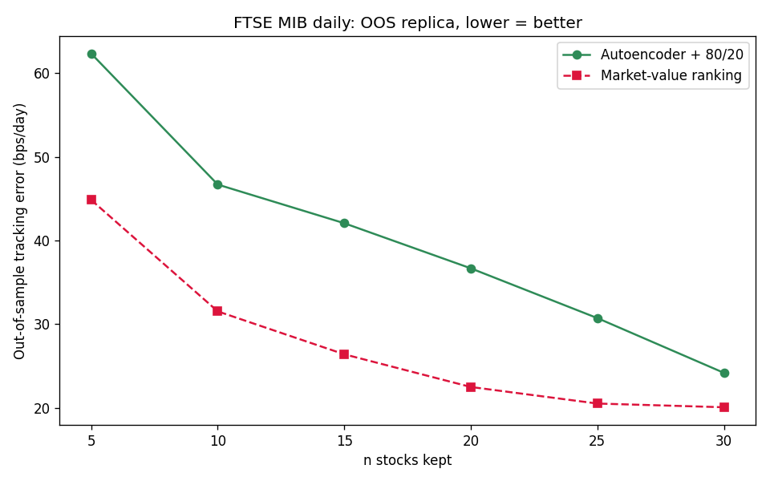

# Tracking the FTSE MIB with a Handful of Stocks

*Can a few stocks replicate a whole index — and does a neural-network stock
selection beat a trivial baseline out-of-sample?*

An end-to-end machine-learning pipeline that builds a **reduced portfolio** to
replicate the FTSE MIB: an **autoencoder** chooses which stocks to keep, a
**constrained optimizer** sets their weights, and the replica is judged
**out-of-sample** by its tracking error. Daily data, ~11 years (Jan 2015 – Jun
2026).

---

## The result

The reduced portfolio tracks the index closely — return correlation **0.99**
against the official FTSE MIB. That is the easy bar.

The real question was different: does the autoencoder's selection replicate the
index **better than a trivial rule** (keep the largest stocks by market cap)
when stocks and weights are **frozen on the train set and measured on unseen
test windows**?

**The honest answer is no.** Out-of-sample, the market-value baseline wins by
about **1.5×** at every portfolio size, and the gap is widest exactly where
selection should matter most (few stocks kept).

| n stocks kept | Autoencoder (bps/day) | Market-value (bps/day) |
|:-:|:-:|:-:|
| 5  | ~62 | ~45 |
| 20 | ~37 | ~23 |
| 30 | ~24 | ~20 |

**Why — and this is the actual finding.** It is not a training failure: the
network generalizes and the selection is stable out-of-sample. The limit is the
*criterion*. The reconstruction error is partly aligned with size
(corr ≈ −0.26), and a cap-weighted index **is** essentially its largest names —
so "take the biggest" is already near-optimal, while the 80/20 rule spends 20%
of the portfolio on small, idiosyncratic "satellite" names, the worst trackers
of a cap-weighted index.

The takeaway is a clean separation between *"it tracks"* and *"it beats the
baseline"*, and between *"the model failed"* and *"the criterion has a
structural limit"*.



---

## Pipeline

Six self-contained modules, from raw prices to an out-of-sample evaluation:

1. **Data loader** (`data_loader_mib.py`) — reads and aligns prices, shares,
   names and the official index into one clean dataset.
2. **Preprocessing** (`preprocessing_mib.py`) — daily returns, an in-house
   value-weighted index (the replication target), rolling windows, and
   point-in-time universe handling.
3. **Autoencoder** (`autoencoder_mib.py`) — an undercomplete, sparse autoencoder
   that compresses standardized returns and yields a per-stock reconstruction
   error.
4. **Stock selector** (`selector_mib.py`) — ranks stocks by error and keeps an
   80/20 core–satellite mix.
5. **Weight optimizer** (`optimizer_mib.py`) — constrained least squares for the
   weights (long-only, ≤30% per stock, fully invested).
6. **Evaluation** (`analysis_mib.py`, `tracking_mib.py`) — freezes everything
   and measures the error on unseen data.

A Streamlit walkthrough of the whole project is in `app_presentazione.py`.

---

## Methodology highlights

The pipeline is built to avoid the classic backtest traps:

- **Rolling windows** — train 1008 / validation 63 / test 126 days, step 126
  (re-selected and re-weighted every ~6 months); the 14 test windows are
  contiguous, so they stitch into one ~7-year out-of-sample backtest.
- **Point-in-time universe** — only stocks quoted for the *whole* window are
  used, so listings and delistings never leak future information.
- **Train-only standardization** — z-scores use train statistics only.
- **Frozen out-of-sample evaluation** — selection and weights are fixed on the
  train set and measured on the unseen test set.
- **Index validation** — the in-house value-weighted index is validated against
  the official FTSE MIB (daily return correlation 0.99).

---

## The autoencoder

| Property | Value (FTSE MIB) |
|---|---|
| Input / output neurons | = live stocks in the window (~32–39) |
| Hidden layers | 1 (the bottleneck) |
| Latent dimension | 4 (chosen by sweep) |
| Hidden activation | SeLU |
| Output activation | Linear |
| Loss | MSE |
| Optimizer | Adam (lr 1e-3) |
| Regularization | L1 on latent activations (sparse AE) |
| Weight init | LeCun normal |
| Training | Early stopping (patience 40), batch 32 |

Well-reconstructed stocks are "core" (systematic); badly reconstructed ones are
"satellite" (idiosyncratic). The per-stock reconstruction error is the
selection signal.

---

## Run it

```bash
pip install -r requirements.txt

# main result: autoencoder vs market-value, all windows + Figure 10
python analysis_mib.py

# the stitched out-of-sample tracking chart (generates tracking_mib.png)
python tracking_mib.py

# interactive walkthrough
streamlit run app_presentazione.py
```

Data (`prices.csv`, `shares.csv`, `names.csv`, `index.csv`) ships with the repo;
prices are Adjusted Close from Yahoo Finance.

---

## Reference

Inspired by Zhang, Liang, Lyu & Fang, *Stock-Index Tracking Optimization Using
Auto-Encoders*, Frontiers in Physics (2020), doi:10.3389/fphy.2020.00388.
Autoencoder background follows A. Géron, *Hands-On Machine Learning with
Scikit-Learn, Keras & TensorFlow* (O'Reilly, 2nd ed.).

---

## License

MIT — see `LICENSE`.
